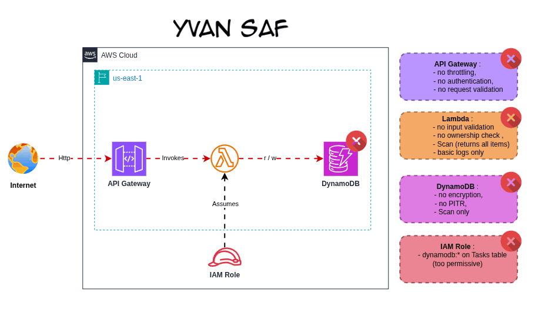
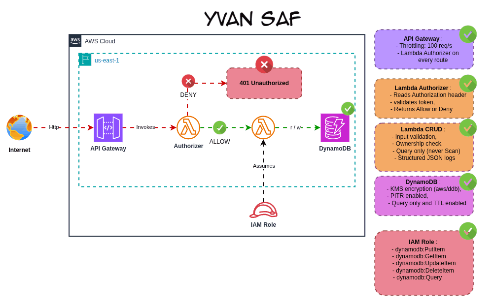

# Serverless Todo API — Security Attack and Defense

**Yvan SAF** | AWS Certified Solutions Architect Associate | Cloud Security

This project builds a serverless Todo API on AWS using Lambda, API Gateway, and DynamoDB. It exists in two versions deployed side by side: a vulnerable version that exposes real attack surfaces, and a hardened version that systematically closes each one.

The goal is not just to show a secure architecture. It is to demonstrate what actually happens when security is missing, and what changes when it is added.

## Architecture

### Vulnerable version



### Hardened version



## What this project demonstrates

### Attacks that succeed on the vulnerable version

| Attack | Endpoint | What happens |
|--------|----------|--------------|
| Enumeration | GET /tasks | Returns all tasks from all users in one request |
| Stored XSS | POST /tasks | Script tags stored as-is in DynamoDB |
| IDOR | GET /tasks/{id} | Any task readable by anyone who knows the ID |
| Cost abuse | 5000 x GET /tasks | No rate limit, Lambda invoked 5000 times |

### What the hardened version blocks

| Attack | Response | Why it is blocked |
|--------|----------|-------------------|
| No token | 401 Unauthorized | Lambda Authorizer rejects the request |
| XSS payload | 400 Bad Request | Input validation rejects HTML characters |
| IDOR attempt | 403 Forbidden | Ownership check fails on userId mismatch |
| 5000 requests | 429 Too Many Requests | API Gateway throttling triggers |

## Repository structure

```
aws-serverless-todo-api/
├── infra/
│   ├── terraform/
│   │   ├── vulnerable/    Terraform for the vulnerable version
│   │   └── hardened/      Terraform for the hardened version
│   └── console/           Step-by-step console deployment guide
├── src/
│   ├── vulnerable/        Python handler with intentional flaws
│   └── hardened/          Python handler + authorizer + validator
├── attack-simulation/
│   ├── README.md          Attack scenario documentation
│   └── scripts/           Shell scripts used during the simulation
├── forensic/
│   └── findings/
│       ├── vulnerable/    Screenshots taken during successful attacks
│       └── hardened/      Screenshots showing blocked attacks
├── docs/
│   ├── architecture/      Architecture diagrams and screenshots
│   ├── decisions/         Architecture Decision Records
│   └── lessons-learned.md
└── README.md
```

## Deploying the vulnerable version

> This version is intentionally insecure. Deploy it only in a sandbox environment and destroy it immediately after testing.

### Prerequisites

- Terraform >= 1.5.0
- AWS CLI configured
- Python 3.12

### Steps

```bash
export AWS_ACCESS_KEY_ID="..."
export AWS_SECRET_ACCESS_KEY="..."
export AWS_SESSION_TOKEN="..."
export AWS_DEFAULT_REGION="us-east-1"

cd infra/terraform/vulnerable
terraform init
terraform plan
terraform apply
```

After deployment, the outputs give you the API endpoint and ready-to-use test commands.

### Clean up

```bash
terraform destroy
```

## Deploying the hardened version

```bash
cd infra/terraform/hardened
terraform init
terraform plan
terraform apply
```

## Running the attack simulation

The attack scripts are in [`attack-simulation/scripts/`](attack-simulation/scripts/). Run them against the vulnerable version first, then against the hardened version to observe the difference.

See [`attack-simulation/README.md`](attack-simulation/README.md) for the full scenario walkthrough.

## Forensic findings

Screenshots collected during the simulation are in [`forensic/findings/`](forensic/findings/). Each screenshot is named and described so the sequence of events is clear.

## Architecture decisions

The [`docs/decisions/`](docs/decisions/) folder contains Architecture Decision Records explaining every significant choice in this project.

## Lessons learned

See [`docs/lessons-learned.md`](docs/lessons-learned.md).

## Security note

All attacks in this project were performed against infrastructure I own and control, in compliance with the [AWS Penetration Testing policy](https://aws.amazon.com/security/penetration-testing/). No third-party systems were involved.

## Author

Yvan SAF
AWS Certified Cloud Practitioner | AWS Certified Solutions Architect Associate
Cameroon | Cloud Security | DevSecOps
