# Attack Simulation

This folder contains the scripts and the walkthrough used to demonstrate the
vulnerabilities of the vulnerable version of the Todo API, and to verify
that the hardened version blocks each one.

The same four scripts are run twice: once against the vulnerable deployment,
once against the hardened deployment. The screenshots below are taken
directly from those runs, side by side, so the contrast is visible without
having to reproduce the attacks yourself.

## Prerequisites

- The target version (`vulnerable` or `hardened`) already deployed with
  `terraform apply` in the matching folder under `infra/terraform/`
- `bash`, `curl`
- `jq` recommended but not required, the scripts fall back to `grep`/`sed`
  when it is not installed
- For the hardened version, a JWT generated with
  `src/hardened/generate_token.py` (see each attack below for which token
  is needed)

## How the scripts work

Every script takes the version to test as its first argument and defaults to
`vulnerable` when none is given:

```bash
./01-enumeration.sh              # tests the vulnerable version
./01-enumeration.sh hardened     # same script, tests the hardened version
```

Instead of hardcoding an API URL, each script reads it directly from the
Terraform state of the target version:

```bash
API=$(terraform -chdir="../../infra/terraform/${VERSION}" output -raw api_endpoint)
```

This means the exact same four files are reused for both deployments, with
no manual copy-pasting of endpoints and no risk of testing the wrong
environment by mistake.

## Attack 1: Enumeration

**Script:** `01-enumeration.sh`

**Vulnerability:** `list_tasks()` in `handler.py` uses a DynamoDB `Scan`
instead of a `Query` filtered by user, and the route has no authentication.
A single unauthenticated `GET /tasks` request returns every task from every
user in the table.

**What the script does:** creates two tasks for two different fake users,
then calls `GET /tasks` and counts how many distinct `userId` values come
back in the same response.

**Vulnerable result:** HTTP 200, tasks from both users returned together.

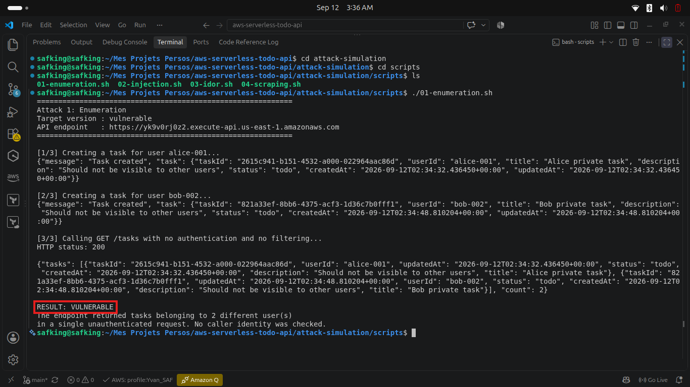

**Hardened result:** HTTP 401, the Lambda Authorizer rejects the request
before it reaches the data. No token was sent on purpose here, this attack
tests the absence of authentication itself.

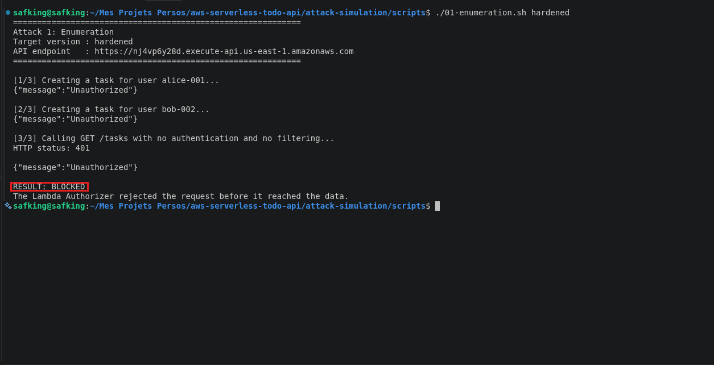

## Attack 2: Stored XSS injection

**Script:** `02-injection.sh`

**Vulnerability:** `create_task()` stores the `title` field exactly as
received, with no validation or sanitization. A script tag submitted as a
title is written to DynamoDB unescaped.

**What the script does:** sends `POST /tasks` with
`<script>alert(document.cookie)</script>` as the title, then reads the task
back to confirm the payload is stored raw.

**Vulnerable result:** HTTP 201, the payload is accepted and returned
unescaped by the API.

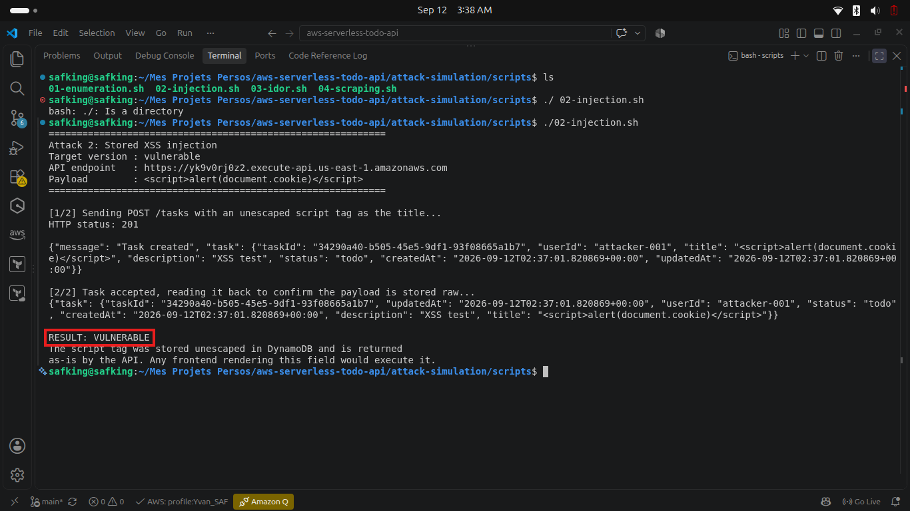

The item as stored in DynamoDB, script tag intact:

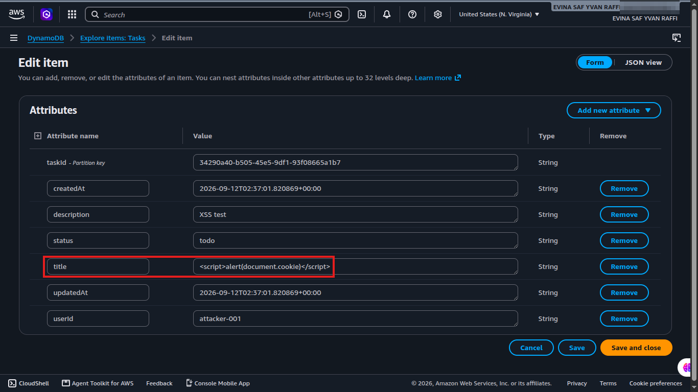

**Hardened result:** HTTP 400, `validator.py` rejects the disallowed
characters before the item is ever written. Requires `AUTH_TOKEN` set to a
valid JWT, otherwise the request is stopped at the authentication layer
before it ever reaches the validator.

```bash
AUTH_TOKEN=$ATTACKER ./02-injection.sh hardened
```

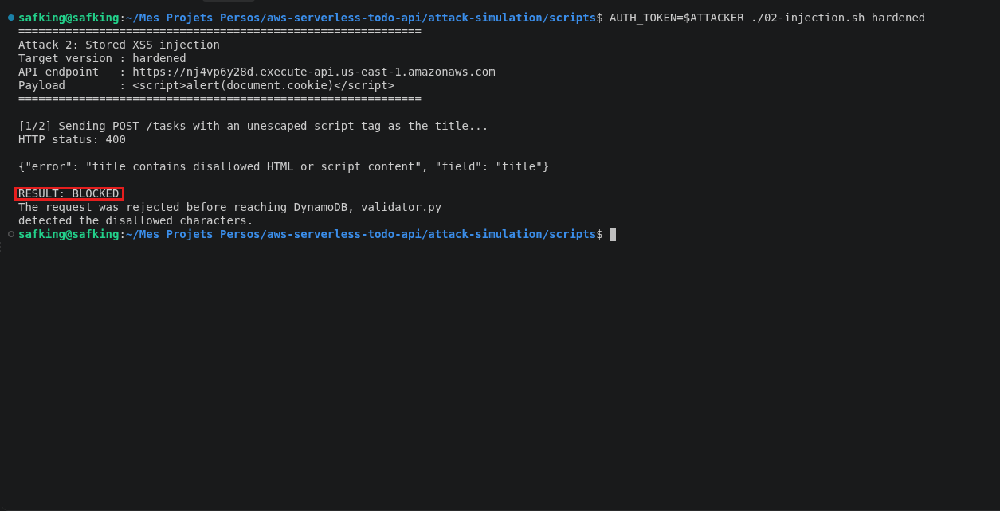

## Attack 3: IDOR (Insecure Direct Object Reference)

**Script:** `03-idor.sh`

**Vulnerability:** `get_task()` and `delete_task()` look up a task by its
`taskId` and act on it without ever comparing the caller's identity to the
task's `userId`. Knowing or guessing a `taskId` is enough to read or delete
any task, regardless of who owns it.

**What the script does:** creates a task for a fake victim user, then reads
and deletes that same task while acting as an attacker who never proves any
identity.

**Vulnerable result:** HTTP 200 on both the read and the delete.

Read:

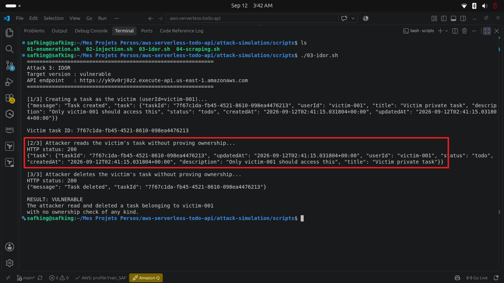

Delete:

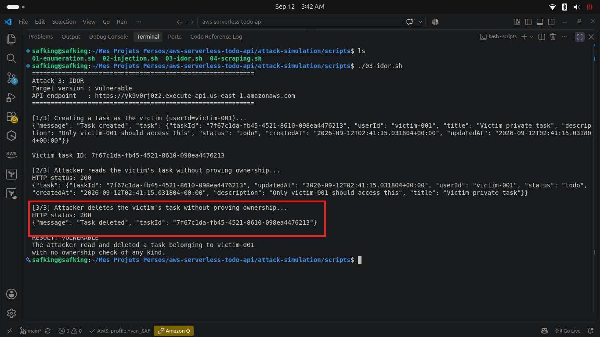

**Hardened result:** HTTP 403 on both attempts, the ownership check rejects
the request once the caller's `userId` does not match the task owner.
Requires two different tokens, one for the victim (to create the task) and
one for the attacker (to attempt the read and delete).

```bash
VICTIM_TOKEN=$VICTIM ATTACKER_TOKEN=$ATTACKER ./03-idor.sh hardened
```

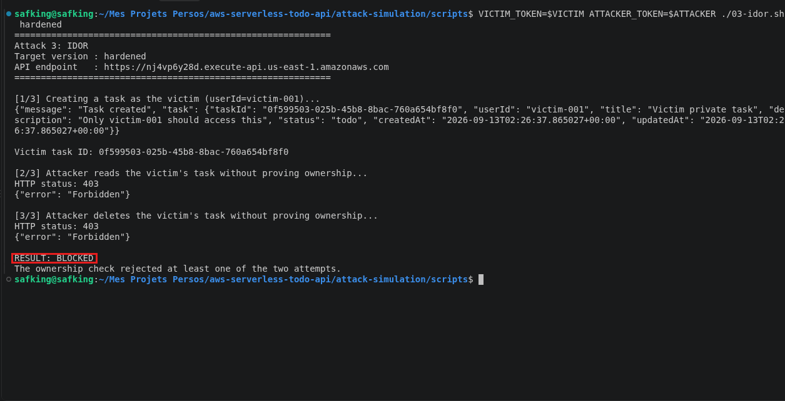

## Attack 4: Scraping and cost abuse

**Script:** `04-scraping.sh`

**Vulnerability:** `api_gateway.tf` configures no throttling of any kind.
Every request reaches the Lambda function and the DynamoDB table, so an
attacker can both scrape the entire dataset and drive up the AWS bill by
sheer volume.

**What the script does:** sends a configurable number of concurrent
requests to `GET /tasks` and reports the breakdown of HTTP status codes
returned.

**Vulnerable result:** 5000 requests, almost all succeed with HTTP 200. A
small number failed with HTTP 503, an accidental account level Lambda
concurrency ceiling, not a security control.

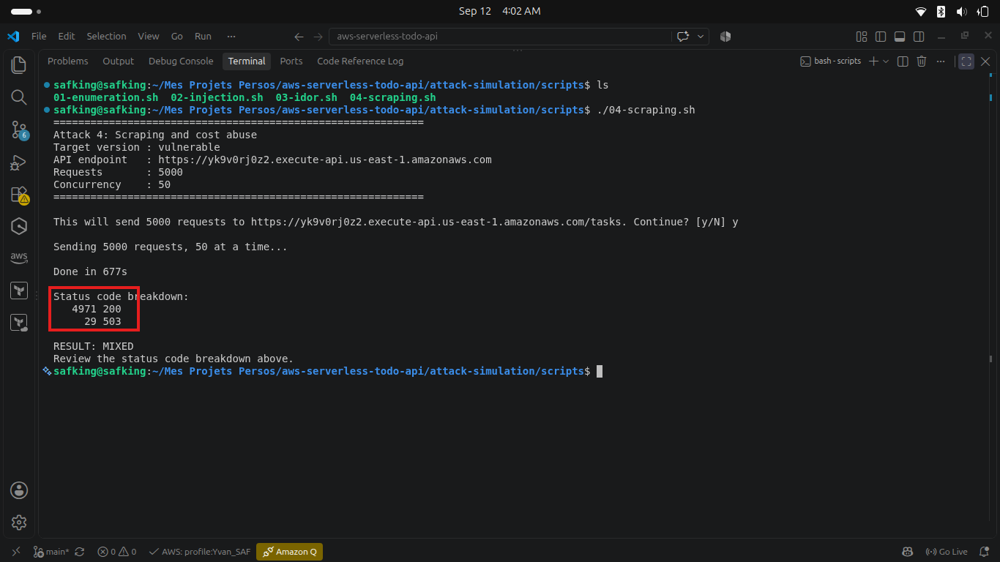

The invocation spike as seen in CloudWatch, including the account's
concurrency throttles:

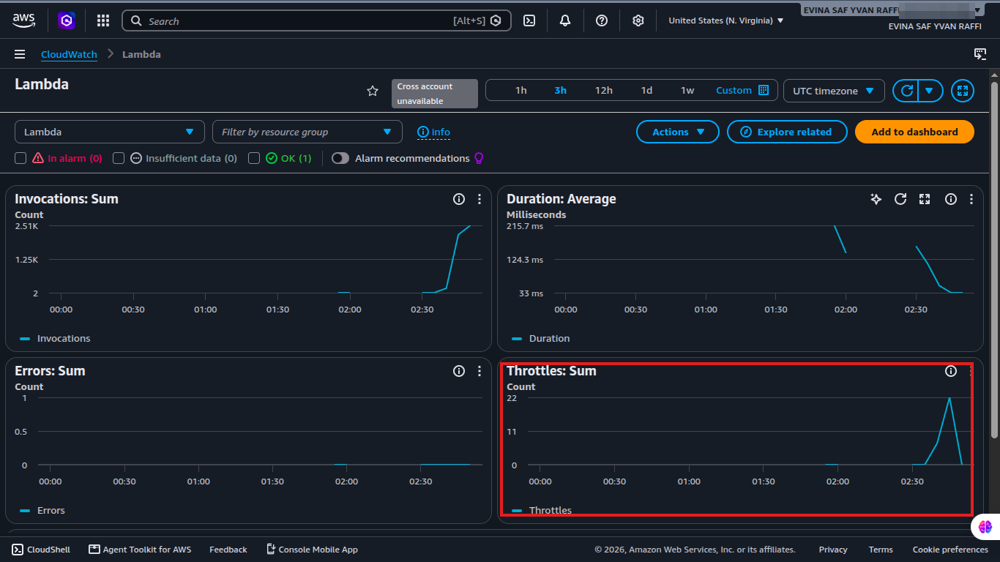

**Hardened result:** once the configured throttle is exceeded, requests
start failing with a predictable HTTP 429. Requires `AUTH_TOKEN` set to a
valid JWT, otherwise every request is rejected with 401 before it can count
against the throttle.

```bash
AUTH_TOKEN=$ATTACKER ./04-scraping.sh hardened 300 20
```

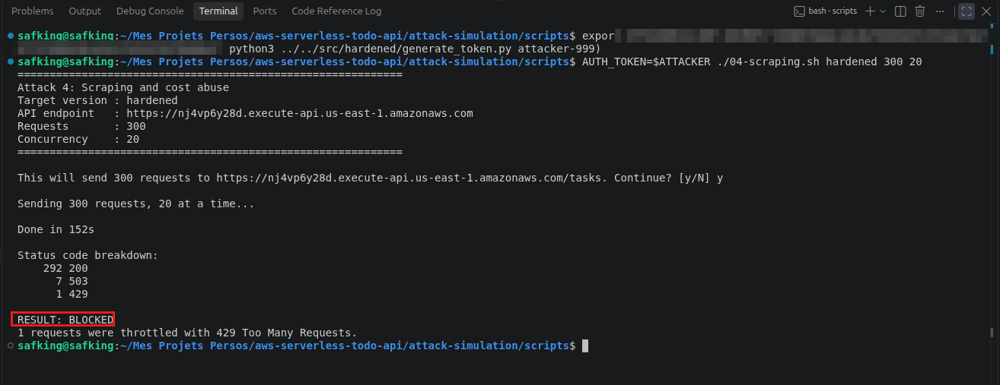

Note: on a fresh personal AWS account, the account's own default Lambda
concurrency limit can sit below the configured API Gateway throttle,
which means very high concurrency mostly produces 503s from Lambda itself
rather than 429s from the throttle. `throttling_rate_limit` was lowered in
`terraform.tfvars` to a value low enough to actually exceed at realistic
test volumes. See `docs/lessons-learned.md` for the full explanation.

## Tracing a legitimate request (hardened only)

X-Ray active tracing and structured CloudWatch logs are hardening measures
with no equivalent to attack on the vulnerable version, they exist to make
a legitimate request traceable end to end, and a blocked one easy to
investigate after the fact.

Service map of a legitimate request, API Gateway through the Lambda
function to DynamoDB:

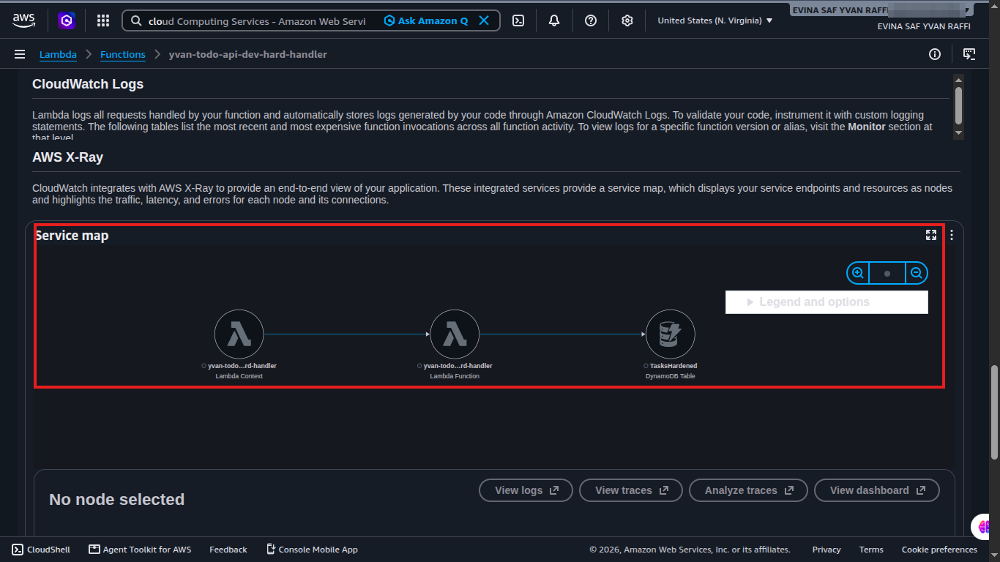

The same invocation's CloudWatch log line, with the X-Ray trace and segment
IDs that tie the two views together:

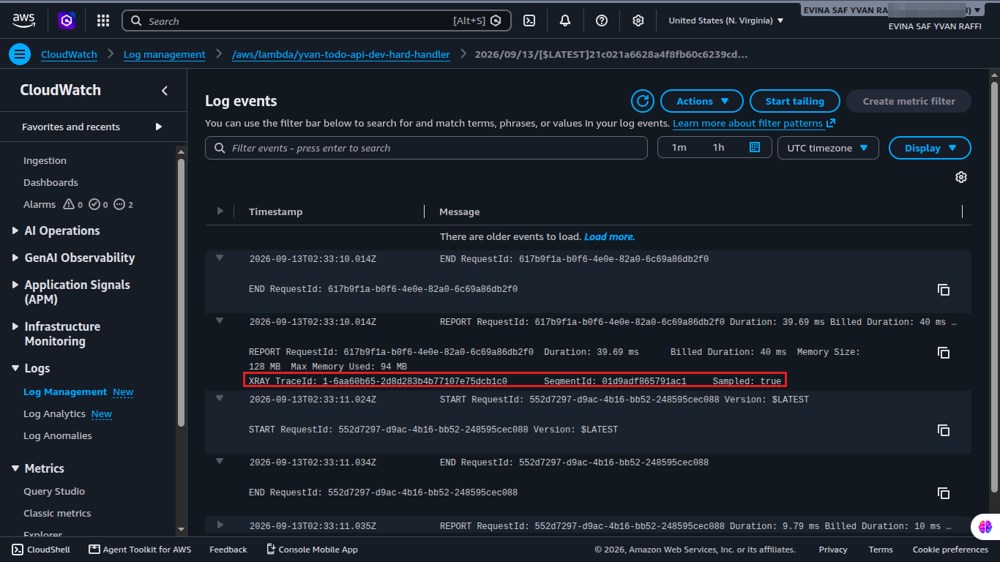

## Running the full sequence

```bash
cd attack-simulation/scripts

./01-enumeration.sh vulnerable
./02-injection.sh vulnerable
./03-idor.sh vulnerable
./04-scraping.sh vulnerable

# after the hardened version is deployed, generate tokens first
export VICTIM=$(JWT_SECRET="..." python3 ../../src/hardened/generate_token.py victim-001)
export ATTACKER=$(JWT_SECRET="..." python3 ../../src/hardened/generate_token.py attacker-999)

./01-enumeration.sh hardened
AUTH_TOKEN=$ATTACKER ./02-injection.sh hardened
VICTIM_TOKEN=$VICTIM ATTACKER_TOKEN=$ATTACKER ./03-idor.sh hardened
AUTH_TOKEN=$ATTACKER ./04-scraping.sh hardened 300 20
```

All screenshots above, plus a few supplementary ones taken during the same
sessions, are collected in
[`forensic/findings/`](../forensic/findings).

## Safety note

All attacks in this simulation were run against infrastructure owned and
controlled by the project author, in compliance with the
[AWS Penetration Testing policy](https://aws.amazon.com/security/penetration-testing/).
No third-party systems were involved.
