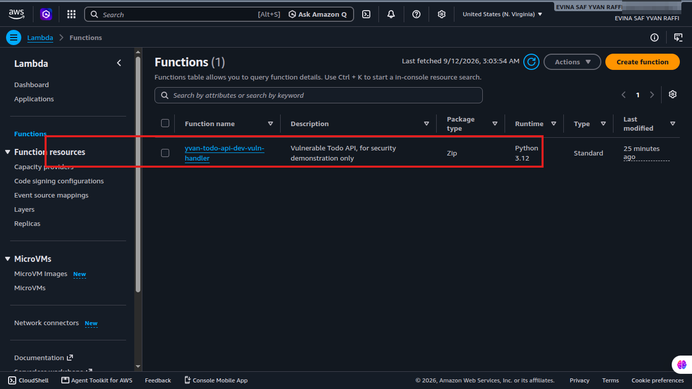
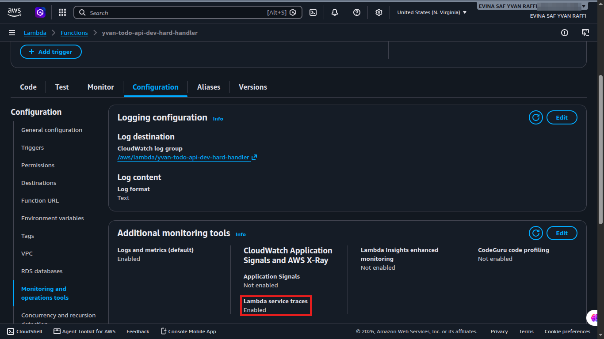
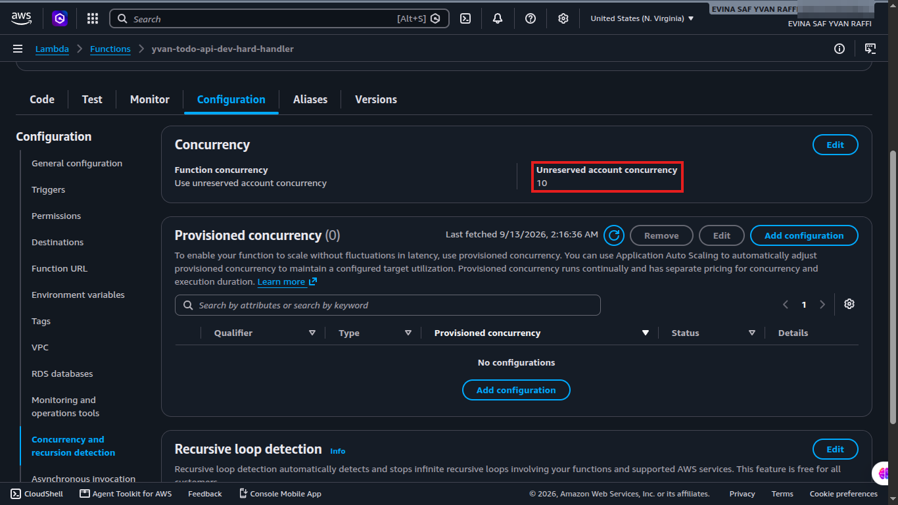
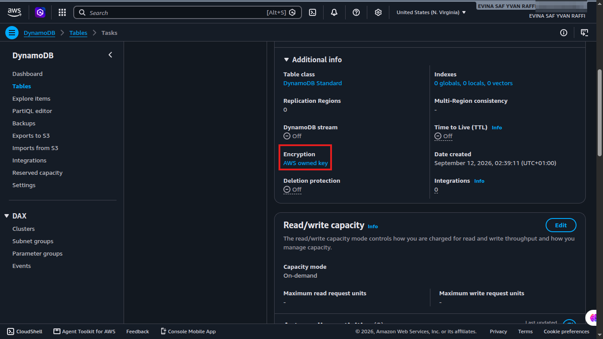
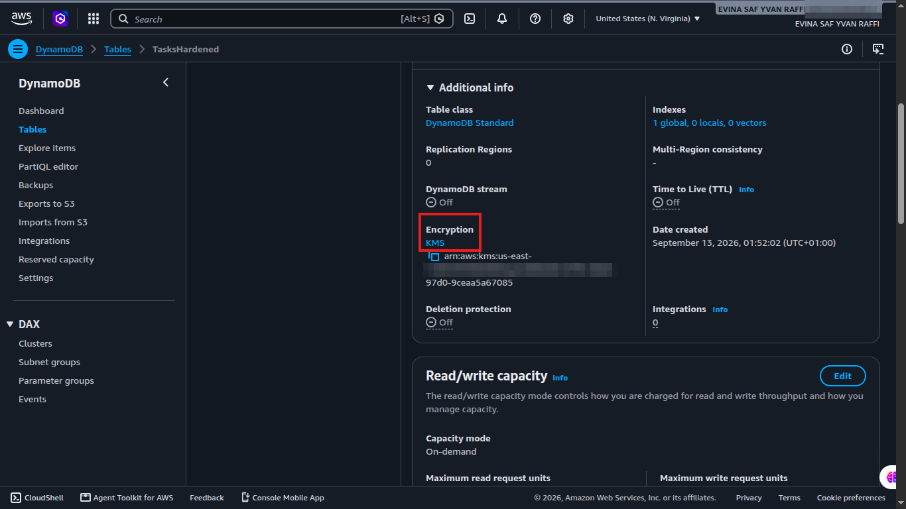
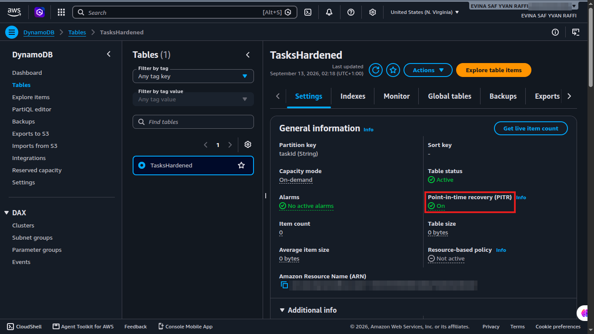
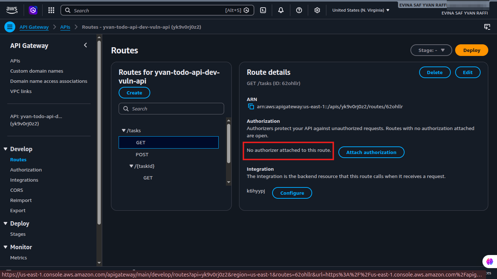
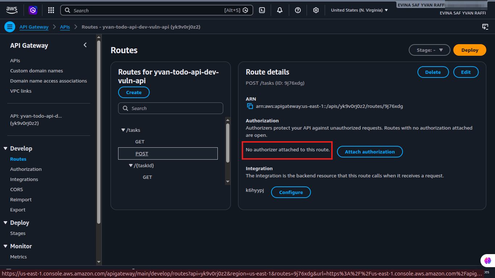
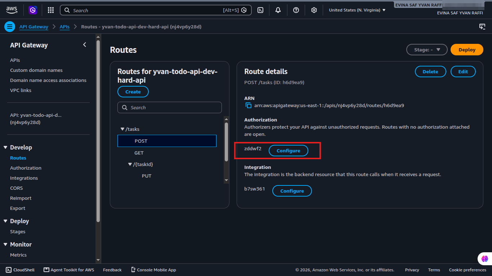

# Console Guide

This guide walks through the AWS Console to see the difference between
the vulnerable and hardened versions directly. Each section shows the
actual screenshot next to the explanation, so you can read this guide
top to bottom and understand what changed without switching between
this file and the `forensic/findings/` folder.

Resource names follow the pattern `yvan-todo-api-dev-vuln-*` for the
vulnerable version and `yvan-todo-api-dev-hard-*` for the hardened
version.

## Lambda

**Console path:** Lambda > Functions

Vulnerable: `yvan-todo-api-dev-vuln-handler`, Configuration >
Monitoring and operations tools. X-Ray tracing is not enabled.

Hardened: `yvan-todo-api-dev-hard-handler`, same tab. Lambda service
traces shows Enabled, this is X-Ray active tracing.

There is also a second function on the hardened side,
`yvan-todo-api-dev-hard-authorizer`, which has no equivalent on the
vulnerable side, since the vulnerable version has no authentication
layer to authorize.

Configuration > Concurrency on the hardened handler shows it sharing
the account's unreserved concurrency rather than a dedicated
reservation. See `docs/lessons-learned.md` for why reserved
concurrency was not used here, the account's own limit was too low to
reserve any meaningful amount.

## DynamoDB

**Console path:** DynamoDB > Tables > (table name) > Additional info

Vulnerable: table `Tasks`. Encryption shows the AWS owned key (not
visible or manageable in KMS), and Point-in-time recovery shows Off.

Hardened: table `TasksHardened`. Encryption shows KMS with a visible
key ARN (the AWS managed key, `aws/dynamodb`).

Point-in-time recovery shows On:

Also check Indexes on the hardened table: a `userId-index` GSI exists,
which is what lets the hardened handler Query instead of Scan. The
vulnerable table has no secondary index at all.

## API Gateway

**Console path:** API Gateway > APIs > (API) > Routes

Vulnerable: any route, for example `GET /tasks`. The Authorization
section reads "No authorizer attached to this route."

Same result on the `POST /tasks` route:

Hardened: any route on `yvan-todo-api-dev-hard-api`. The Authorization
section shows an authorizer ID attached, with a Configure button next
to it, this is the JWT Lambda Authorizer.

Also check Deploy > Stages > `$default` > Throttling, the hardened
stage has a rate and burst limit configured. The vulnerable stage does
not.

## IAM

**Console path:** IAM > Roles

Vulnerable: `yvan-todo-api-dev-vuln-lambda-role`, Permissions tab. The
inline policy grants `dynamodb:*` on the Tasks table, a wildcard
rather than a specific list of actions.

Hardened: `yvan-todo-api-dev-hard-lambda-role`. The inline policy lists
exactly five DynamoDB actions (`PutItem`, `GetItem`, `UpdateItem`,
`DeleteItem`, `Query`), scoped to the table and its GSI. There is also
a separate, more restricted role,
`yvan-todo-api-dev-hard-authorizer-role`, which has no DynamoDB
permissions at all, since the authorizer only verifies a token.

No screenshot is included for this section yet, the policy documents
above can be read directly in `infra/terraform/vulnerable/iam.tf` and
`infra/terraform/hardened/iam.tf`.

## CloudWatch and X-Ray

**Console path:** the Monitor tab on a Lambda function, or CloudWatch >
Log groups

Hardened only, the vulnerable version has no distinguishing tracing
setup here. The X-Ray service map on
`yvan-todo-api-dev-hard-handler` shows the request path from API
Gateway through the Lambda function to the DynamoDB table.

The function's log group,
`/aws/lambda/yvan-todo-api-dev-hard-handler`, shows a `REPORT` line
with the `XRAY TraceId` and `SegmentId` fields correlating that
invocation with its X-Ray trace.

## SNS and alarms

**Console path:** SNS > Topics, and CloudWatch > Alarms

Both versions create an alerts topic and a Lambda errors alarm
(`*-lambda-errors`). The hardened version additionally creates
`*-api-throttled`, an alarm on the API's 4xx rate, which includes 429
throttling responses, giving visibility into abuse attempts that the
vulnerable version has no equivalent for.

No screenshot is included for this section yet, since no alarm has
fired during testing. If you want to see one triggered, the scraping
attack in `attack-simulation/README.md` produces enough Lambda errors
and throttled requests to trip both alarms.
